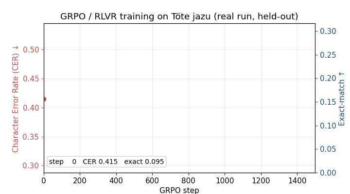

# RLVR for Post-OCR Transliteration of Kazakh Arabic Script (Töte Jazu)

A CPU-trainable, fully reproducible feasibility study: **Group Relative Policy
Optimization (GRPO) with a deterministic verifiable reward** applied to the
post-OCR transliteration step (Arabic-script characters → Cyrillic) for Kazakh
Töte jazu.

Author: Yerali Agibayev, Astana IT University.
Status: **work-in-progress / feasibility study.** Stage 0 of a larger pipeline.

---

 

This repository isolates and validates **stage 3** of an intended three-stage
pipeline:

1. Synthetic image rendering (Cyrillic → cipher → Arabic-script fonts)  — *future work*
2. TrOCR fine-tuning to recognize Arabic-script text                    — *future work*
3. **RLVR post-correction / transliteration → Cyrillic**               — *this repo*

It is **not** a state-of-the-art claim and it does **not** show RL beating
supervised learning. It shows that the RLVR machinery works on CPU and improves
a lightly-supervised base policy from the reward signal alone, and it reports —
rather than hides — the baselines it does not beat, with an explanation of why.

---

## Results (held-out, full 84-word test set, seed 0)

| Method                         | Exact-match ↑ | CER ↓ |
|--------------------------------|:-------------:|:-----:|
| Deterministic lookup table     | 0.143         | 0.297 |
| SFT (light, 900 steps) — RL base | 0.036       | 0.605 |
| **SFT → GRPO (RLVR, 1500)**    | **0.131**     | **0.418** |
| SFT (full, 2500 steps)         | 0.286         | 0.277 |

**GRPO improves its weak base by 31% relative CER using
only the verifiable reward, but does **not** surpass the lookup table or full
SFT. On a near-deterministic synthetic cipher with no morphological context,
that is the *expected* boundary of RLVR — the method is predicted to help in the
ambiguous, context-rich, OCR-noisy regime of **real** data, which is the next
stage. See `paper/paper.pdf` Sec. V–VI.

---

## Layout

```
.
├── README.md
├── requirements.txt          # pinned: torch 2.12.1, matplotlib 3.10.8 (CPU only)
├── run_all.sh                # reproduce everything from scratch (~8–10 min CPU)
├── src/
│   ├── tote_grpo.py          # core: data, seq2seq+attention, SFT, GRPO+KL, verifier
│   ├── driver.py             # phases: sft_light | sft_full | grpo | purerl
│   ├── grpo_chunk.py         # resumable GRPO runner (checkpoints every chunk)
│   ├── lut_baseline.py       # deterministic lookup-table baseline
│   ├── consolidate.py        # gather metrics -> results/results.json
│   └── make_figure.py        # learning-curve figure -> paper/ + results/
├── paper/
│   ├── paper.tex             # IEEEtran WIP paper
│   ├── paper.pdf             # compiled (3 pages)
│   └── curve.pdf             # figure used by the paper
├── results/
│   ├── results.json          # consolidated numbers (authoritative)
│   ├── grpo_curve.json       # GRPO monitoring-subset learning curve (n=30)
│   ├── curve.pdf
│   └── metrics/              # raw per-phase metric files (m_*.json)
└── checkpoints/              # provided trained models (~1.2 MB each)
    ├── sft_light.pt          # RL base policy
    ├── sft_full.pt           # full supervised baseline
    └── grpo.pt               # final RLVR policy
```

## Method summary

- **Policy:** bidirectional-GRU encoder + GRU decoder with dot-product attention
  (emb 64, hidden 128). Attention is what lets it generalize past memorized words.
- **SFT warm-start:** teacher forcing. Pure RL from random init cold-starts and
  fails (run `python3 src/driver.py purerl` to see ~0.0 exact-match).
- **GRPO:** group size G=6, group-relative advantages (no value network),
  reward `r = (1 − CER) + 0.5·1[exact]` (deterministic verifier, no learned
  reward model), temperature annealed 1.1→0.6.
- **KL-to-reference:** penalty `β·(log π_θ − log π_ref)` with β=0.04 against the
  frozen SFT base. **Required** — without it, GRPO on a converged policy drifts
  and degrades held-out accuracy.

## Reproduce

```bash
pip install -r requirements.txt          # CPU torch is enough; no GPU needed
bash run_all.sh                          # regenerates checkpoints, results, figure, PDF
```

Every number is seeded (`seed=0`) and produced on CPU. To run on the **real**
Quran parallel corpus instead of the synthetic cipher, pass a TSV of
`arabic<TAB>cyrillic` pairs — the RL code is unchanged:

```bash
python3 src/tote_grpo.py --data pairs.tsv --warmup 900 --steps 1500
```

## Important caveats (state these if anyone challenges validity)

- The corpus is a **synthetic cipher**, not verified Töte jazu orthography. It is
  a machinery testbed; the five homograph pairs are linguistically *motivated*,
  not a linguistic claim.
- There is **no OCR front-end yet**; the system transliterates clean symbol
  strings, not recognizer output.
- The six references in `paper.tex` should be **verified against their DOIs**
  before submission.
